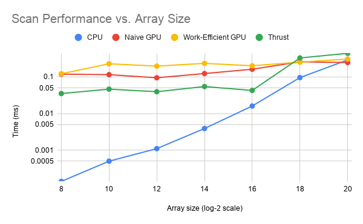
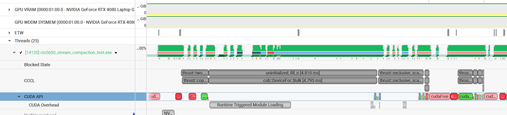
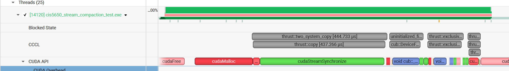

CUDA Stream Compaction
======================

**University of Pennsylvania, CIS 565: GPU Programming and Architecture, Project 2**

* Rin Fukuoka
  * [LinkedIn](https://www.linkedin.com/in/rin-fukuoka-4260772a2/) / [Personal website](https://www.rfukuoka.com/)
* Tested on: Windows 11, i9-13900HX @ 2.20 GHz, 32GB RAM, RTX 4080 Laptop GPU 12GB
#### Overview

In this project, I implemented the scan (prefix sum) algorithm and stream compaction in CUDA, using several different scan implementations so their performance can be compared:

* **CPU Scan**: serialized scan on the CPU. It is used as the baseline for performance comparisons. O(n) total work.
* **Naive GPU Scan**: parallel scan that does log(n) passes over the array, where each pass adds an element to another element some distance away and doubles that distance each time. This does O(n log n) total work across all threads, more than the sequential algorithm, but each pass runs in parallel.
* **Work-Efficient GPU Scan**: parallel GPU scan, using an up-sweep (reduce) phase followed by a down-sweep phase. This does O(n) total work, matching the CPU algorithm's work complexity, while still running in O(log n) parallel steps.
* **Thrust Scan**: `thrust::exclusive_scan` from the Thrust library implementation.

Using these scan implementations, I built three stream compaction implementations: CPU compaction without scan (using a simple sequential loop), CPU compaction with scan (using the CPU scan implementationand a scatter step), and work-efficient GPU compaction (using the work-efficient GPU scan and a GPU scatter step).

#### Performance Analysis
This was measured by averaging 5 samples per array size, using a block size of 128 for GPU kernels. GPU timings were measured with CUDA events , and the CPU timing was measured with `std::chrono`.




| Array Size (2^n) | CPU (ms) | Naive GPU (ms) | Work-Efficient GPU (ms) | Thrust (ms) |
|---|---|---|---|---|
| 8  | 0.0001 | 0.1196 | 0.1225 | 0.0353 |
| 10 | 0.0005 | 0.1157 | 0.2294 | 0.0465 |
| 12 | 0.0011 | 0.0950 | 0.1976 | 0.0395 |
| 14 | 0.0039 | 0.1239 | 0.2353 | 0.0547 |
| 16 | 0.0160 | 0.1625 | 0.2022 | 0.0428 |
| 18 | 0.0961 | 0.2587 | 0.2544 | 0.3301 |
| 20 | 0.2918 | 0.2475 | 0.3081 | 0.4430 |

The CPU implementation is by far the fastest for small arrays. The GPU implementations and the Thrust implementation stay relatively flat as array size grows, until we reach an array size of around 2^18 to 2^20, where the GPU implementations catch up to and pass the CPU implementation, and Thrust becomes the slowest of the three.

The main performance bottleneck for the GPU implementations at small array sizes is kernel launch overhead. The work-efficient scan launches a separate kernel for every level of the up-sweep and down-sweep tree. Meanwhile, the CPU's simple sequential loop has none of this overhead and also benefits from good cache locality. As the array size grows, the actual computation done per kernel launch grows too, so the fixed launch overhead becomes a smaller fraction of the total time and the GPU implementations catch up. 

One way to improve the GPU implementations further would be to use shared memory: load a block's worth of data into shared memory once, do the up-sweep and down-sweep within shared memory, and only write the final result back to global memory. 

#### Looking at Thrust using Nsight Systems

 

Profiling `thrust::exclusive_scan` in Nsight Systems shows that the actual scan is a small fraction of the total time reported by `StreamCompaction::Thrust::scan`. So the bottleneck in the Thrust implementation isn't the scan algorithm itself, it's the allocation, value-initialization, host-to-device copy, and synchronization around it. 

#### Test Program Output 

```
****************
** SCAN TESTS **
****************
    [  17  14  24  40  31  30  23  19  33  33   2  42  43 ...   6   0 ]
==== cpu scan, power-of-two ====
   elapsed time: 0.0007ms    (std::chrono Measured)
    [   0  17  31  55  95 126 156 179 198 231 264 266 308 ... 6109 6115 ]
==== cpu scan, non-power-of-two ====
   elapsed time: 0.0018ms    (std::chrono Measured)
    [   0  17  31  55  95 126 156 179 198 231 264 266 308 ... 6053 6061 ]
    passed
==== naive scan, power-of-two ====
   elapsed time: 0.198688ms    (CUDA Measured)
    passed
==== naive scan, non-power-of-two ====
   elapsed time: 0.260224ms    (CUDA Measured)
    passed
==== work-efficient scan, power-of-two ====
   elapsed time: 0.654336ms    (CUDA Measured)
    passed
==== work-efficient scan, non-power-of-two ====
   elapsed time: 0.185344ms    (CUDA Measured)
    passed
==== thrust scan, power-of-two ====
   elapsed time: 0.145376ms    (CUDA Measured)
    passed
==== thrust scan, non-power-of-two ====
   elapsed time: 0.073728ms    (CUDA Measured)
    passed

*****************************
** STREAM COMPACTION TESTS **
*****************************
    [   1   0   0   0   3   0   3   3   3   1   2   2   1 ...   2   0 ]
==== cpu compact without scan, power-of-two ====
   elapsed time: 0.0014ms    (std::chrono Measured)
    [   1   3   3   3   3   1   2   2   1   1   3   3   3 ...   2   2 ]
    passed
==== cpu compact without scan, non-power-of-two ====
   elapsed time: 0.0011ms    (std::chrono Measured)
    [   1   3   3   3   3   1   2   2   1   1   3   3   3 ...   2   3 ]
    passed
==== cpu compact with scan ====
   elapsed time: 0.0053ms    (std::chrono Measured)
    [   1   3   3   3   3   1   2   2   1   1   3   3   3 ...   2   2 ]
    passed
==== work-efficient compact, power-of-two ====
   elapsed time: 0.365568ms    (CUDA Measured)
    passed
==== work-efficient compact, non-power-of-two ====
   elapsed time: 0.203776ms    (CUDA Measured)
    passed
```

#### CMakeLists.txt

Added compile options /Zc:preprocessor to MSVC. 